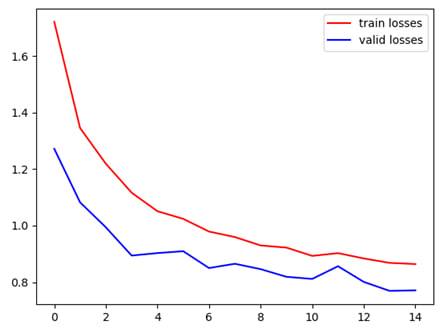
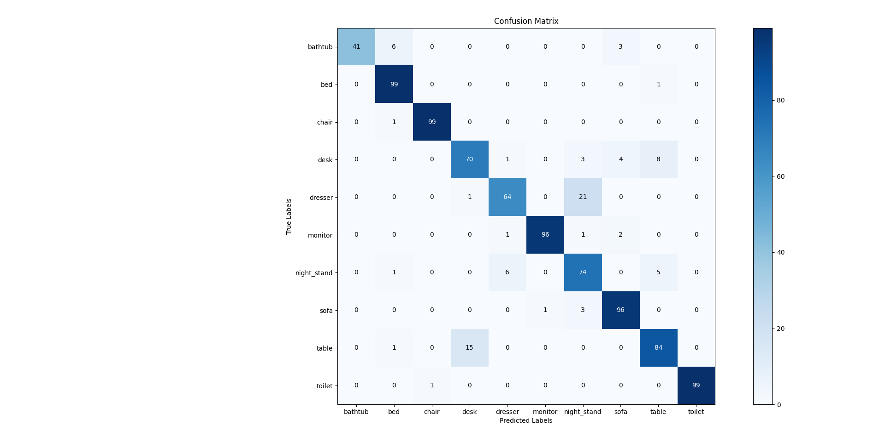

# VoxNet
This implementation is based on <a href="https://ieeexplore.ieee.org/document/7353481"> VoxNet 3D Convolutional Network</a> to classify 3D objects represented as voxel grids. <br />
Install the project dependencies:
```sh
 pip install -r requirements.txt
```
Download the **ModelNet10** dataset <a href="https://www.kaggle.com/datasets/balraj98/modelnet10-princeton-3d-object-dataset"> here </a>
First you need to create the voxel grids out of the downloaded meshes. To do so run the following command:
```sh
 python .\files_preparation.py ModelNet10 -f -x
```
which will fix the files headers, voxelize the meshes and save them in the <b>VoxelGrids</b> folder (or any other name specified)
To then run the training type the following command:
```sh
 python train_model.py
```

## Project Structure

```sh
└── PointNet/
  ├── requirements.txt
  ├── files_preparation.py
  ├── train_model.py
  ├── VoxelDataset.py
  └── voxelnet.py
```

## Best Training Result so far
<p float="left">


</p>

